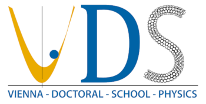

# ESI Winter School 2020

https://vds-physics.univie.ac.at/winter-school-2020/

|     VDS         |      HEP meets ML        |     QR code           |
|-----------------|--------------------------|-----------------------|
|  |  |  |

ESI Winter School Machine Learning in Physics, Vienna.
All material collected for the first part of the particle physics track of the school,
corresponding to the lectures and tutorials given on Wednesday, Feb 19.

 * open at https://colab.research.google.com/github/WolfgangWaltenberger/winterschool
